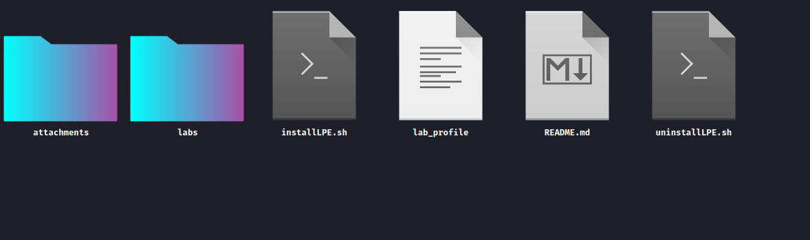

<h1><b>Linux Privilege Escalation<b></h1>

> **Owner** : Mr. Sup3rN0va | "28-07-2021"

> **Tags** : #linux, #priv-esac, #pentest, #red-team

---

<h2><b>Table Of Contents</b></h2>

---

- [**Introduction**](#introduction)
- [**Installation**](#installation)
- [**Notes**](#notes)
- [**Future Endeavours**](#future-endeavours)

---

## **Introduction**

---

- This lab is targeted for those who are begineers in Pentesting world or have some basic understanding and wanted to understand the basics of Post-Exploitation process
- The labs are designed aiming to meet the basic requirements for Linux Privilege Escalation
- The labs are very easy and thus will be a piece of cake if you know what to look and how to look
- The main focus is on enumeration and exploiting the mis-configs
- Most importantly, because this is build over docker, so we don't have kernel exploits in the lab right now, but will be adding more labs soon

---

☝️ <a href="#">Back to top</a> ☝️

---

## **Installation**

---

- Because the labs are designed over docker, installation and cleanup is very easy.
- Steps:
  - Create a fresh `ubuntu` VM, you can also take the latest one as we are not targetting Kernel Exploits as of now
  - Update the VM: `sudo apt-get update && sudo apt-get upgrade -y && sudo apt-get dist-upgrade -y && sudo apt-get install -y build-essential linux-headers-$(uname -r)`
  - Install `docker` and dependencies: `sudo apt-get install -y git lolcat docker docker.io`
  - Once installed, add current user to `docker` to avoid using `sudo` everytime you run `docker` and also this is required by the `installer` script to function properly
  - To do that: `sudo usermod -aG docker $USER`
  - Now `logout` your VM and login back to apply all the changes made
  - To check that all the dependencies are installed and we are good to go, run: `docker ps -a`
  - If no error shows up, we can proceed with lab installation
  - Clone the repo: `git clone https://github.com/m2sup3rn0va/PTLabs.git`
  - Then: `cd PTLabs/Linux_Privilege_Escalation/` and you will see

    

  - Then: `chmod +x installLPE.sh && chmod +x uninstallLPE.sh`
  - Then: `./installLPE.sh`. Sit tight and enjoy the auto-installation :wink: :rainbow:
  - You have to be patient while the installation is under progress
  - Once done, just run : `source $HOME/.bashrc` and you are ready to kick in :clap: :clap:
  - To start the labs you just have to type: `lab1` and hit enter
  - You can also do `lab` and hit tab to see what all labs are there
  - Once you are done with all the labs, you can do complete cleanup using: `./uninstallLPE.sh`
  - This will revert back all the changes

---

☝️ <a href="#">Back to top</a> ☝️

---

## **Notes**

---

- If you want to see what all labs are installed, you can run: `docker ps -a`
- Currently, for `lab10` and `lab11` uses the same container image, so you will not find `lab11` seperately but the command `lab11` works

---

☝️ <a href="#">Back to top</a> ☝️

---

## **Future Endeavours**

---

- Will add more labs related to advance topics of Linux Privilege Escalation like `Seccomp`, `Capabilities` and `Apparmor`
- Also, the current labs are `single` escalation boxes. Next model will be more complex due to chaining in escalation process to get to the root

---

☝️ <a href="#">Back to top</a> ☝️

---
